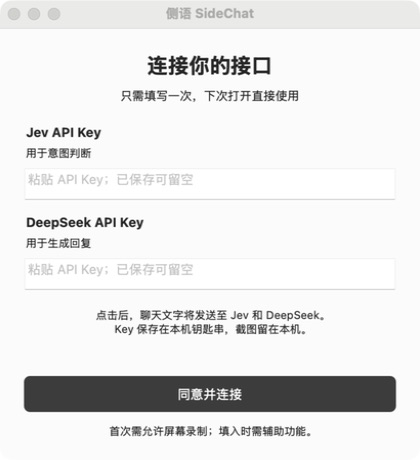
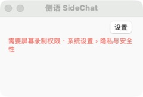

<p align="center"></p>
<h1 align="center">侧语 SideChat</h1>
<p align="center">填两个 Key，打开微信，自动识别聊天区域。</p>

[下载 Mac 0.2.0 测试版](https://github.com/francoeur003/sidechat-mac/releases/tag/sidechat-v0.2.0) · [操作说明](docs/操作指南.md) · [安装说明](docs/安装说明.txt) · [原项目与许可](NOTICE.md)

## 真实界面





[查看连接操作步骤](docs/操作指南.md)：打开设置 → 点击连接 → 测试两个接口 → 返回浮窗。截图来自实际运行，未包含密钥和私人聊天。

## 极简版 0.2.0

适用 **Apple Silicon（M1 及更新芯片）、macOS 14+**。自带运行环境，无需 Python、命令行工具或本地大模型。

1. 安装后填写 **Jev API Key** 和 **DeepSeek API Key**。
2. 点击「同意并连接」：先检查两个接口，再保存到本机钥匙串。
3. 首次按系统提示允许屏幕录制，打开一个微信聊天窗口。
4. 自动定位消息区域，显示意图和两条回复建议。复制或填入后，由你决定发送。

模型、接口地址和话术均内置默认值，不需要填写。Jev 使用 `jev-latest` 负责意图判断和候选排序；DeepSeek 使用 `deepseek-flash` 生成回复。两个 Key 各自只发往对应的官方服务，不经本项目服务器。0.1.0 的单服务授权不会自动迁移成双服务授权；升级后需重新点击连接。

## 自动识别的范围

应用捕获微信窗口，在本机根据侧栏、标题分隔线、输入区边界自动定位聊天区域，裁剪后使用 Apple Vision OCR。窗口缩放后重新计算，右侧展开的面板也必须被排除。不能确定范围时停止分析，再提供「调整范围」作为手动补救。

只支持已验证的浅色微信桌面布局。深色布局、过小窗口、歧义布局可能需要调整或不受支持；图片、表情和语音不作为文字消息分析。切换聊天会丢弃旧结果；最新一条是自己发送时等待对方新消息。

## 数据与费用

- 截图留在本机用于 OCR，临时截图随后清理。
- 点击「同意并连接」后，识别的聊天文字、上下文和候选回复会发往 Jev / DeepSeek。
- 连接测试、意图判断、回复生成和排序消耗各自服务商的 API 额度。
- Key 保存在 macOS Keychain，不进入源码、设置文件或安装包。
- 「填入」需要辅助功能权限，**不会自动点击发送**。可从菜单栏暂停读屏。
- 模型判断和分数不保证客观正确或“最优”，请检查后再使用。

本地设置：`~/Library/Application Support/SideChat/`；运行日志：`~/Library/Logs/SideChat.log`。不读取原 Jev 应用的私人配置。

## 安装与签名

将 DMG 中的 SideChat 拖入 Applications。此社区包使用 ad-hoc 签名，**尚无 Apple Developer ID 签名与公证**。首次运行可能被 macOS 阻止；确认来源与 SHA256 后，由使用者在系统设置 → 隐私与安全性允许打开。无需关闭全局 Gatekeeper。Intel 未构建、未验收。

## 验证

- 32 项回归测试通过：自动定位、缩放、Retina、抽屉排除、歧义拒绝、消息状态隔离、服务商隔离、授权迁移及异常处理。
- 使用合成句真实调用 Jev + DeepSeek，完成意图判断、两条回复生成和排序，单次约 4.1 秒。
- 真实微信截图识别到聊天标题和 3 个文字气泡，排除侧栏、右侧小程序面板及输入框。实时截图遇到最后一条为图片时停止分析。
- 打包应用已实际点击连接，两个接口测试完成后返回小浮窗。完整微信识别到回复上屏的桌面链路仍待屏幕录制授权后验收。
- 不同 Mac、Intel、深色微信和新包「填入」链路未测。

作者抖音主页入口等待实际链接后启用，当前未配置。

## 从源码构建

```sh
uv venv --python 3.12 build/distribution-venv
uv pip install --python build/distribution-venv/bin/python -r packaging/requirements-sidechat.txt
PYTHONPATH=src:tests build/distribution-venv/bin/python -m unittest test_auto_region test_deepseek test_hud_state test_perception_region test_sidechat_providers -v
./packaging/build_sidechat.sh
```

输出位于 `dist/`。原 Jev 入口保留，侧语使用独立入口 `src/sidechat_app.py`。

基于 [jev-chat/jev-chat-jarvis-mac](https://github.com/jev-chat/jev-chat-jarvis-mac) 修改，保留 eatmoreduck 原作者版权和 MIT 许可；见 [LICENSE](LICENSE)、[NOTICE.md](NOTICE.md) 与[上游说明](docs/UPSTREAM_README.md)。这是独立社区项目，与微信、Jev、DeepSeek 官方无隶属关系。
