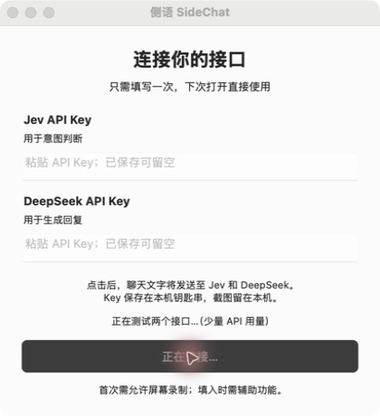

# 侧语 SideChat 操作指南

下载 [Mac 0.2.0 测试版](https://github.com/francoeur003/sidechat-mac/releases/tag/sidechat-v0.2.0)，将 SideChat 拖入「应用程序」后打开。适用于 Apple Silicon、macOS 14 及以上。

## 1. 连接两个接口

在设置中填写 Jev API Key 和 DeepSeek API Key，点击「同意并连接」。接口地址、模型都已经配置好。已保存的 Key 可留空，应用从本机钥匙串读取。

## 2. 等待连接测试

按钮显示「正在连接」，应用真实测试两个接口。测试会消耗少量 API 额度；通过后保存设置并返回小浮窗。

## 3. 首次允许读取屏幕

如果看到下图，在 macOS「系统设置 → 隐私与安全性 → 屏幕与系统音频录制」（部分系统称「屏幕录制」）中允许 SideChat，按系统提示重新打开应用。

## 4. 打开微信聊天

保持聊天窗口可见，应用自动定位消息区域。收到对方文字消息后分析意图并给出候选回复；你可以复制，或在允许辅助功能后填入微信输入框，再自行检查并发送。最新消息为自己发送、图片或表情时可能等待下一条文字消息。自动定位失败时可调整范围。

## 本次演示范围

上面的截图按实际操作顺序采集：打开设置、点击连接、测试完成返回浮窗。没有公开私人聊天或密钥。32 项回归测试通过，真实 Jev + DeepSeek 合成消息链路已跑通；完整打包应用「微信消息 → 回复上屏 → 填入」仍待系统屏幕录制权限后验收。这份指南不是全流程录屏。

本包尚未经过 Apple Developer ID 签名与公证。首次打开可能需要在系统设置中确认来源后允许运行。
